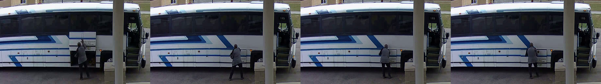
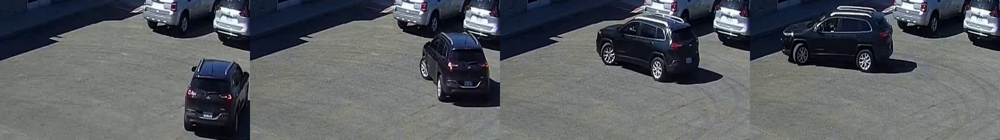
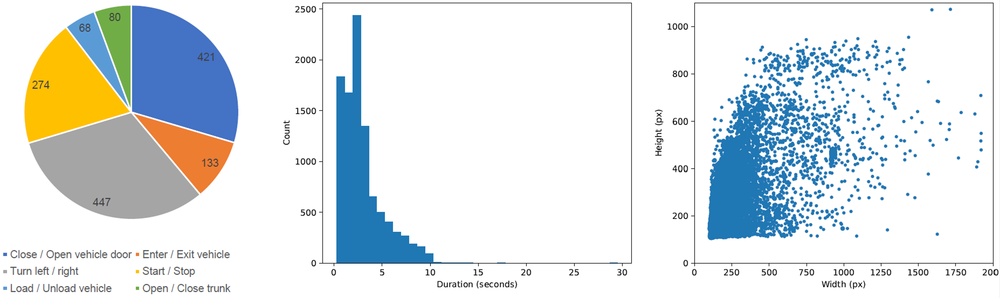
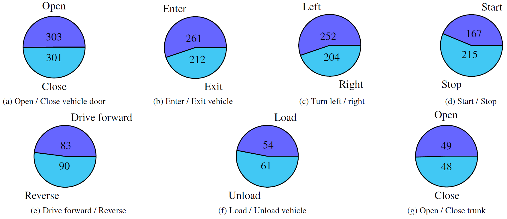
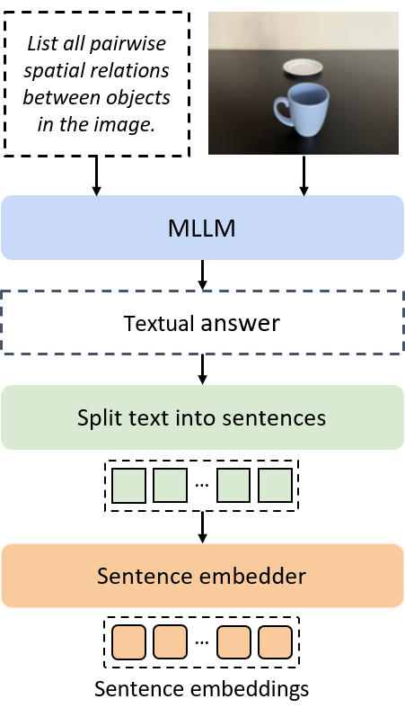

# SOVABench: A Vehicle Surveillance Action Retrieval Benchmark for Multimodal Large Language Models

Official repository for the WACV Workshops 2026 paper:
> [**SOVABench: A Vehicle Surveillance Action Retrieval Benchmark for Multimodal Large Language Models**](https://arxiv.org/abs/2601.04824)

We introduced **SOVABench (Surveillance Opposite Vehicle Action Benchmark)**, a challenging benchmark for action retrieval in vehicle-related surveillance scenarios. Its two complementary protocols (**inter-pair and intra-pair retrieval**) jointly provide both a global assessment of action-level representation quality and a measure of temporal direction understanding, enabling analysis of failure modes in action description. In addition, we construct the **MLLM-to-Embedding framework** to obtain sentence-level embeddings from MLLMs, enabling both retrieval and classification. Our experiments demonstrate that even a **simple, instruction-following framework** improves performance compared to contrastive methods, while providing interpretable representations.

---

## 🔍 Overview

| Component | Description |
|-----------|-------------|
| **SOVABench (Inter-pair)** | Retrieval benchmark of 9,882 surveillance clips (including 1,423 queries) from MEVA and VIRAT, organized into 6 action classes. |
| **SOVABench (Intra-pair)** | Benchmark of 2,300 videos containing CLIp, organized into 7 antonymic action pairs. |
| **MLLM-to-Embedding Framework** | Converts MLLM textual responses into sentence-level embeddings for classification and retrieval. |
| **Results** | MLLM-to-Embedding framework obtains superior results on both protocols in SOVABench with respect to contrastive VLMs. However, all systems remain close to random in the Intra-pair protocol, exposing the difficulty of temporal-direction understanding in surveillance videos. |

---

## 📊 SOVABench
SOVABench (Surveillance Opposite Vehicle Actions Benchmark) is a real-world content-based video retrieval (CBVR) benchmark designed for vehicle-centric surveillance actions. Unlike classical CBVR datasets that focus on scene similarity, SOVABench evaluates action discrimination and temporal direction understanding.

To evaluate both coarse action discrimination and temporal direction understanding, we define two complementary evaluation protocols: the Inter-pair protocol, which merges opposite actions into unified classes for action-level retrieval, and the Intra-pair protocol, which focuses on distinguishing between visually similar but temporally inverse actions.

<figure align="center">
    
    <figcaption>Close trunk</figcaption>
</figure>
<figure align="center">
    
    <figcaption>Open vehicle door</figcaption>
</figure>
<figure align="center">
    
    <figcaption>Start</figcaption>
</figure>
<figure align="center">
    
    <figcaption>Turn left</figcaption>
</figure>

SOVABench contains 14 vehicle-related actions grouped into 7 opposite-action pairs:

| Action | Opposite |
| ------ | -------- |
| Drive forward |	Reverse |
| Enter vehicle	| Exit vehicle |
| Load vehicle | Unload vehicle |
| Open trunk | Close trunk |
| Open vehicle door | Close vehicle door |
| Start | Stop |
| Turn left | Turn right |

### SOVABench (Inter-pair)
- **Goal:** distinguish between different action pairs (coarse-grained). Opposite actions are merged into a single class. 
- **Metric:** mAP (sample-level mean Average Precision).
- **Dataset size:** 1,423 queries and 9,882 samples (including distracting human-only activity clips).

<figure align="center">
    
    <figcaption>Distribution of the query samples, the duration of video clips, containing short clips, and the distribution of resolutions, with unfrequent frame shapes</figcaption>
</figure>

### SOVABench (Intra-pair)
- **Goal:** distinguish between opposite actions (temporal direction understanding). Each pair becomes a binary retrieval task.
- **Metric:** Pair-mAP.
- **Dataset:** 2,300 queries without distracting samples.

<figure align="center">
    
    <figcaption>Distribution of samples within each opposite action pair</figcaption>
</figure>

---

## 🏗️ MLLM-to-Embedding Framework
The MLLM-to-Embedding framework treats MLLMs as black-box visual describers. Instead of relying on their internal latent representations, the framework converts the generated text into a structured embedding space.

<p align="center">
  
</p>

**Pipeline steps:**
1. Query an MLLM with an image/video + instruction.
2. Split the textual response into individual sentences.
3. Embed each sentence with a sentence-similarity encoder.
4. Compute maximum cosine similarity for classification or retrieval.

**Strengths:**
- Unified embeddings for images and videos.
- Long MLLM descriptions are split into atomic sentences and embedded independently, reducing noise and allowing arbitrary long MLLM outputs.
- Task-aware prompting: simple instructions (“briefly classify the action…”) improve performance and inference step.

---

## 📦 Installation

### 1. Clone the repository
```bash
git clone https://github.com/orabasseda/mllm_embedding.git
cd mllm_embedding
```

### 2. Create a Conda environment and install flash-attention
```bash
conda env create -f environment.yml
conda activate mllm-embeddings-sovabench
pip install "flash-attn==2.7.4.post1" --no-build-isolation
```

---

## 🧰 Usage
1. Obtain and download original videos and annotations of VIRAT ([data](https://viratdata.org/#getting-data), [annotations](https://gitlab.kitware.com/viratdata/viratannotations)) and MEVA ([data](https://mevadata.org/index.html#getting-data)). The downloaded dara should be placed following the subsequent folder structure within the ``datasets`` folder:
```bash
datasets
├── VIRAT                   # VIRAT root folder
│   ├── videos_original     # Folder to place the raw downloaded videos from the VIRAT Video Ground Dataset Release 2.0
│   ├── viratannotations    # Folder containing the cloned annotation repository
│   └── generated_clips     # Generated samples
└── MEVA
    ├── videos              # Folder with the downloaded videos
    ├── meva-data-repo      # Folder with the downloaded annotations
    └── generated_clips     # Generated samples
```

2. Generate SOVABench:
```bash
./scripts/generate_data.sh
```

3. Compute the embeddings for a general MLLM using the MLLM-to-Embedding framework:
```bash
python src/mllm_embeddings_sovabench/framework/mllm_pipeline.py \
    --question_path ./datasets/sovabench_interpair.tsv \ # Path to the SOVABench samples
    --fps 1 \ # Number of FPS for sampling rate
    --output_filepath outputs/minicpmv_4_5_scene.json \ # Output JSON filepath
    --base_path your/root/path \
    --model_name openbmb/MiniCPM-V-4_5 \ # Model name from HuggingFace
    --instruction "Describe this video." \ # User instruction to the MLLM
    --system-prompt "" # System instruction to the MLLM, if empty, uses default system prompting strategy
```
where ``--question_path`` can be changed to one of the following: ./datasets/sovabench_interpair.tsv or ./datasets/sovabench_intrapair.tsv.

4. Evaluate the resulting JSON file using SOVABench's metrics:
```bash
python src/mllm_embeddings_sovabench/evaluation/metrics.py \
    --embedder Alibaba-NLP/gte-large-en-v1.5 \ # 
    --results-file ./outputs/minicpmv_4_5.json \ # Path to the results file to be evaluated
    --method easy \ # Metric to compute. Options are easy and binary. Default easy.
    --question-path ./datasets/sovabench_interpair.tsv \ # Path to the SOVABench samples
```
The ``easy`` strategy computes mAP of the queries while ``binary`` evaluates Pair-mAP (for SOVABench (Intra-pair)).

The list of supported models and their instructions is shown in [Supported Models](./src/mllm_embeddings_sovabench/framework/README.md).

---

## 🧪 Experiments
We evaluate:
- Contrastive Image-VLMs: CLIP, SigLIP2, MERU
- Contrastive Video-VLMs: CLIP4Clip, VideoCLIP, ActionCLIP
- General MLLMs: InternVL3.5, MiniCPM-V 4.5
- Video-MLLMs: VideoLLaVA, VideoLlama3, VideoChat-R1
- API MLLMs: Gemini 2.5 Flash, Qwen3-VL 235B

All MLLMs use the MLLM-to-Embedding pipeline.

| Model Category | Best Inter-pair (mAP) | Best Intra-pair (Pair-mAP) |
| -------------- | --------------------- | -------------------------- | 
| Random | 3.4 | 50.3 |
| Contrastive Image-VLMs | 30.6 | 51.3 |
| Contrastive Video-VLMs | 36.6 | 51.4 |
| General MLLMs | **38.3** | 53.6 |
| Video-MLLMs | 32.4 | 53.1 |
| API MLLMs | 33.2 | **53.9** |

Best overall (Inter-pair): ➡️ *MiniCPM-V 4.5 (task-aware)* — **38.3 mAP**

Best overall (Intra-pair): ➡️ *Gemini 2.5 Flash (task-aware)* — **53.9 Pair-mAP**

**Key findings**
- Contrastive methods underperform with respect to MLLMs with the MLLM-to-Embedding framework in capturing the dynamics of vehicle actions.
- Task-aware prompting consistently boosts performance and reduces inference latency.
- Temporal direction understanding remains largely unsolved: most models perform close to the random baseline.

---

## 🧑‍💻 Citation
If you use this repository, please cite:

```bibtex
  @inproceedings{sovabench2026rabasseda,
    title={SOVABench: A Vehicle Surveillance Action Retrieval Benchmark for Multimodal Large Language Models},
    author={Rabasseda, Oriol and Li, Zenjie and Nasrollahi, Kamal and Escalera, Sergio},
    booktitle={Proceedings of the IEEE/CVF Winter Conference on Applications of Computer Vision (WACV) Workshops},
    month={March},
    year={2026},
    pages={95-104}
  }
```

---

## ⚖️ License and Ethics
SOVABench is constructed entirely from MEVA and VIRAT. It does not redistribute any original video data. Instead, it provides metadata and scripts so users can regenerate the clips only after obtaining access to the original datasets under their respective licenses.

- MEVA: Creative Commons Attribution 4.0 (CC-BY-4.0)
- VIRAT: VIRAT Video Dataset Usage Agreement
- SOVABench metadata: released under CC-BY-4.0

The authors disclaim liability for:
- annotation imperfections,
- misuse of the dataset,
- unintended interpretations of the metadata.
